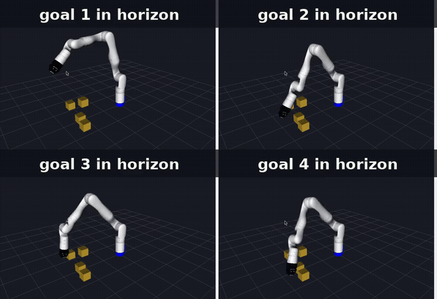
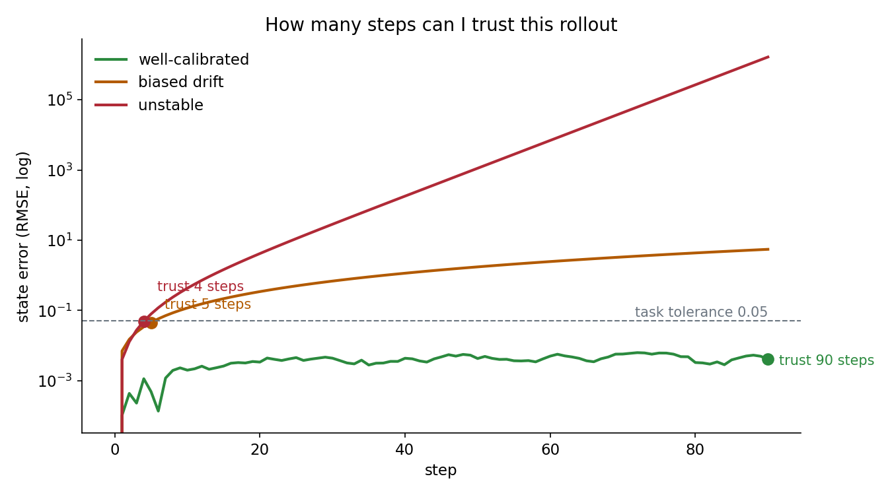
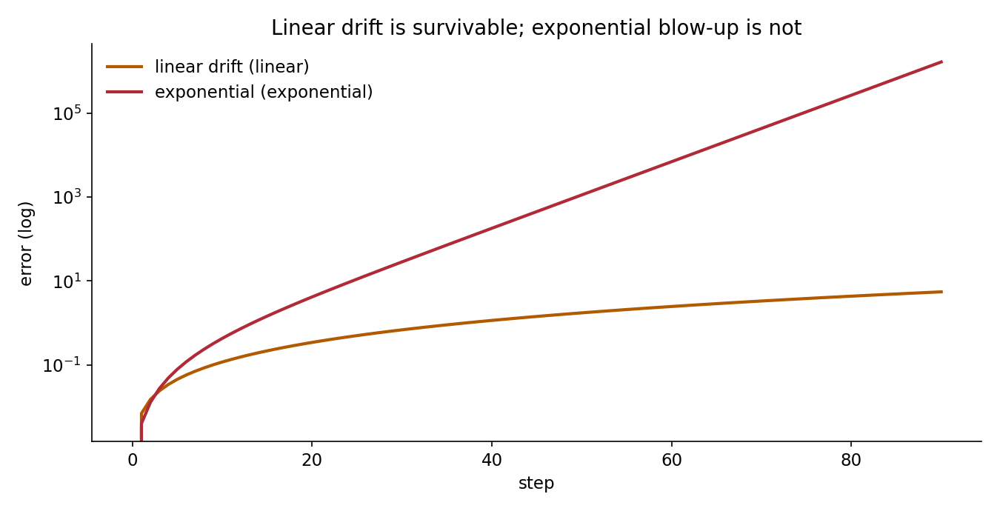
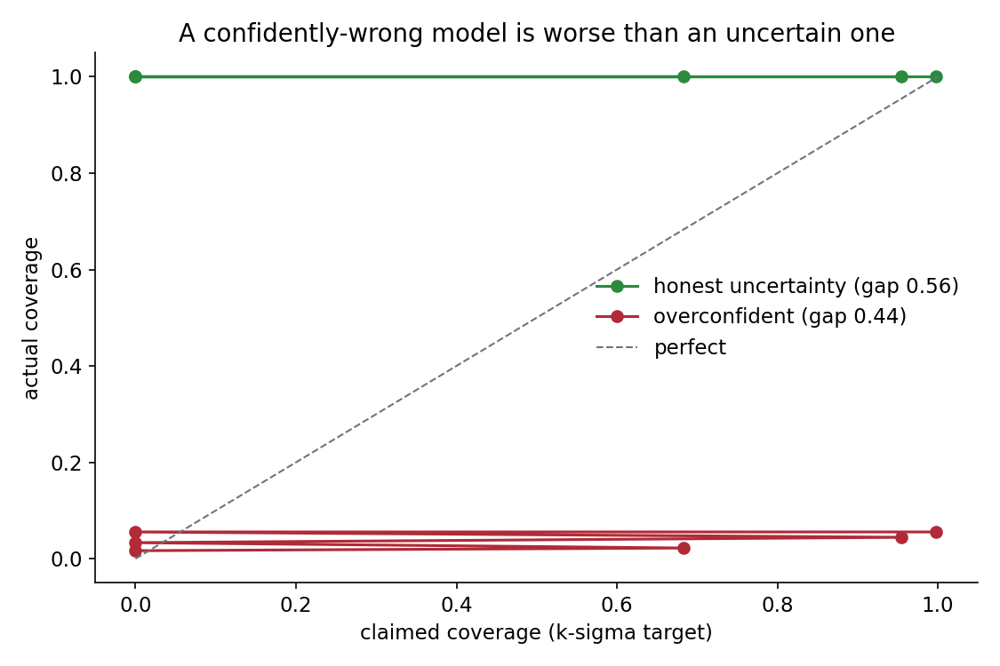
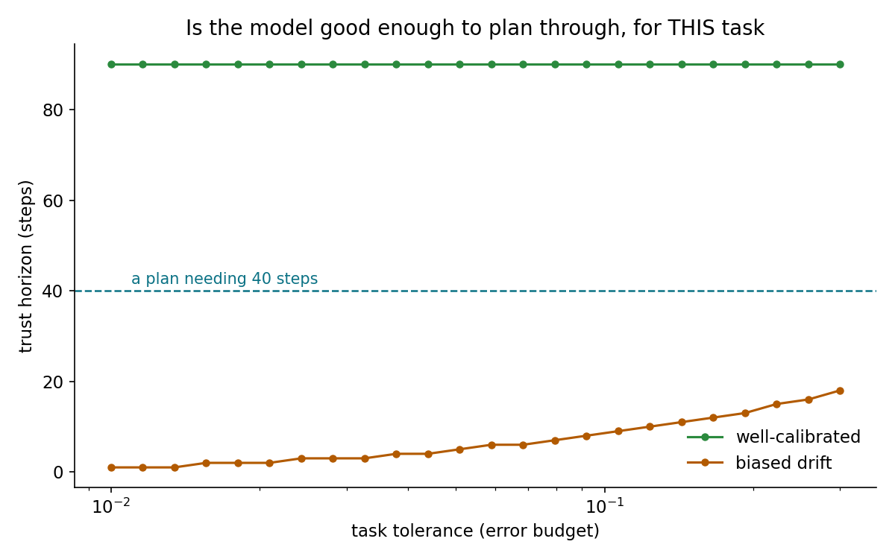

# TrustHorizon



*RViz simulation (Kinova Gen3). Before vs after.*

**Can I trust this rollout, and for how many steps?** Metrics and a harness that answer that for a learned simulator, before you plan through it.

Learned world models are now used as reinforcement-learning environments and even co-evolve with the policies they train. A May 2026 world-model survey and the MuJoCo Playground writeup both say the same thing: the open problem is no longer building these simulators, it is knowing *when to trust a rollout*. Fidelity, long-horizon consistency, and trustworthy use as a sim-to-real bridge remain unsolved, and contact-rich humanoid tasks are where the gap is widest.

This package does not build a world model. It judges one you already have.



*Three learned models against ground truth on the same actions. The headline number is the trust horizon: the last step before error crosses the task tolerance. A model can look excellent for four steps and be useless by ten.*

## What this ships

- **Trust horizon** — the largest number of steps whose error stays inside a tolerance. A first crossing, not a mean, because a model you can trust for 40 steps and then not is trustworthy for 40 steps.
- **Long-horizon consistency** — does error grow *linearly* (survivable drift) or *exponentially* (instability)? The exponential case is the dangerous one and is classified explicitly.
- **Physics plausibility** — cheap invariants a model must not violate even when it is inaccurate: no NaN, velocity and acceleration within limits, contact penetration bounded, and passive energy non-increasing. A model that injects energy is caught here.
- **Calibration** — if the model reports uncertainty, is it honest? A confidently-wrong model scores worse than an uncertain one, which is the point.
- **Divergence onset** — the step where predicted and reference trajectories separate beyond noise.
- **The sim-to-real trust question** — given a task's own error budget, does the model stay trustworthy for as many steps as your plan needs?

## What this is not

Not a world model, and not a trainer. There are no deep-learning dependencies; the demos run on a toy 1-D dynamical system with a soft contact so every metric has a known answer. You bring the real rollouts. The contribution is the measurement discipline, not the dynamics.

## Install

```
pip install git+https://github.com/megazron/trusthorizon-worldmodel
```

NumPy is the only dependency. Clone and use `PYTHONPATH=src` to run from source.

## Quickstart

```
wmeval selftest                                   # known-answer checks
python3 examples/three_models.py                  # good vs biased vs unstable
wmeval eval --pred pred.json --ref ref.json --tol 0.05
wmeval suite --model mock-unstable --scenarios examples/scenarios
```

A rollout file is JSON with `states` (T+1 by d), `actions` (T by a), `times`, and optional `channels`. The predicted and reference rollouts must share an initial state and an action sequence, or the harness refuses to compare them, because an error computed over misaligned rollouts is a number nobody should trust.

The bundled example prints:

```
=== well-calibrated ===
  median trust horizon : 80 steps      growth: linear      plausibility: 100%
=== biased-drift ===
  median trust horizon : 5 steps       growth: linear      plausibility: 100%
=== unstable ===
  median trust horizon : 1 steps       growth: exponential plausibility: 0%
```

## The metrics

### Trust horizon
The first step at which per-step state RMSE crosses your tolerance. Reported in steps and seconds. This is the number to quote instead of "the model is pretty accurate".

### Long-horizon consistency
Fits both a linear and an exponential growth model to the error curve and reports which fits better, with the rate. Linear drift you can plan around; exponential growth means small errors compound and the model is unusable past a short horizon however good it looks early.



*The same axes tell the two apart: a straight line on a log axis is exponential blow-up; a curve that flattens is drift.*

### Physics plausibility
Invariants that should hold even for an inaccurate model. Passive energy that rises, a velocity past its limit, a penetration past its threshold, or a NaN each fail a named check. A model can be wrong and still plausible; one that is implausible cannot be trusted at all.

### Calibration
If the model emits a per-step uncertainty, this measures whether the truth actually falls inside its claimed bands, as an ECE-style gap. An overconfident model (tiny uncertainty, large error) is worse than an honest one, and the metric says so.



*Actual coverage against claimed coverage. On the diagonal is honest; far below it is a model that is sure and wrong.*

## The sim-to-real trust question

A model is usable as a bridge for a task only over the horizon where its error stays inside the task's own tolerance. `wmeval trust --task-tol 0.03 --needed-steps 40` turns "the world model is good" into "you may plan 40 steps ahead for a 30 mm task, and your plan needs 60, so no".



*Trust horizon as a function of the task's error budget. A plan is only safe where its curve sits above the steps it needs.*

## Plugging in your own model or rollouts

Implement a `WorldModel` with `reset(state)` and `step(action) -> next_state` (optionally `(next_state, sigma)`), then `rollout_from_model(model, x0, actions)`; or load recorded rollouts with `Rollout.load_json` / `load_npz`. Point `wmeval suite --model your.module:Class` at a scenario directory.

## Reading the report

`report.to_text`, `to_json`, and a self-contained `to_html` give per-scenario trust horizons, growth classification, plausibility pass rate and calibration, plus an aggregate summary.

## Limitations

The demos use toy dynamics, so the numbers there are illustrative; the metrics are what transfer. Plausibility checks are cheap invariants, not a physics engine. Calibration needs a model that reports uncertainty. This measures trust; it does not repair a model.

## License

MIT, see [LICENSE](LICENSE).
